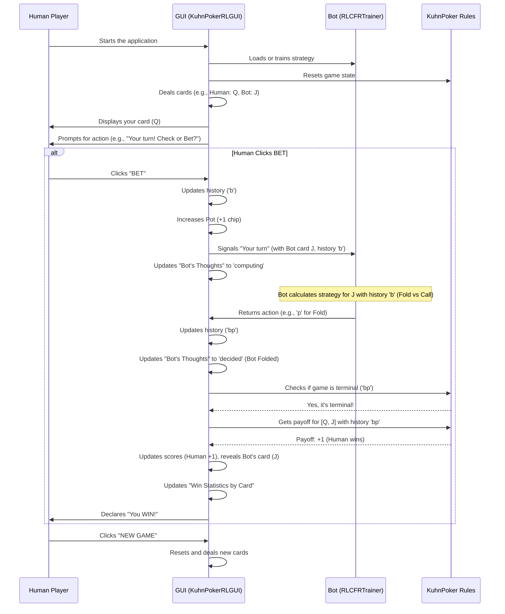

# Chapter 2: Kuhn Poker Graphical User Interface (GUI)

Welcome back! In [Chapter 1: KuhnPoker Game Rules](01_kuhnpoker_game_rules_.md), we learned the foundational rules of Kuhn Poker and how our `KuhnPoker` class acts as the game's official rulebook. But what good is a game if you can't play it?

This chapter introduces the **Kuhn Poker Graphical User Interface (GUI)**. This is where the rules come to life! It's the interactive window that lets you, a human player, play against our smart poker bot. Think of it as your personal digital poker table, complete with cards, chips, and even a dealer (the bot itself!).

### Why Do We Need a Graphical User Interface (GUI)?

Imagine you've built a super-smart robot that can play chess perfectly. How would you play against it? You wouldn't want to type "e2-e4" into a text box and then have the robot reply with "e7-e5" in more text. You'd want to see the board, move your pieces, and watch the robot move its pieces.

That's exactly what the GUI provides for our poker bot. Its central use case is: **Allowing a human player to easily play against the trained RL-CFR bot in a visual and interactive way.**

The GUI solves several problems:
1.  **Visibility:** You can see your cards, the bot's hidden card (at the end), the pot, and the sequence of actions.
2.  **Interaction:** You can click buttons to make your moves (Check/Fold, Bet/Call).
3.  **Feedback:** It shows you who won, how many chips, and tracks your progress.
4.  **Learning:** Importantly, it gives you special insights into *how* the bot thinks, making its advanced strategies transparent.

---

### The Interactive Poker Table: Key GUI Concepts

Our GUI is built using Python's `tkinter` library, which is a standard way to create graphical applications. It brings together all the game's elements into one friendly window.

Let's look at the core parts you'll interact with:

#### 1. The Game Board
This is the main area where cards are displayed, the pot is shown, and the history of actions unfolds.

#### 2. Your Cards and the Bot's Card
You'll see your private card (Jack, Queen, or King). The bot's card will be hidden until the end of the round.

#### 3. Action Buttons
These are your way to play! You'll click either "CHECK/FOLD" or "BET/CALL" to make your move, just like in a real poker game. The text on the buttons will change depending on the game situation (e.g., "CHECK" or "FOLD").

#### 4. Pot and Game History
The current size of the pot (how many chips are at stake) is always visible. There's also a clear history of actions taken by both players (e.g., "You: Bet → Bot: Call").

#### 5. Score Tracking
The GUI keeps a running tally of your score, the bot's score, and how many games have been played.

#### 6. Enhanced Features for Learning (The "Bot's Thoughts")
This is where our GUI goes beyond just playing poker! It includes powerful features to help you understand the bot:
*   **Win Statistics by Card:** Tracks how often you or the bot win when holding a specific card (Jack, Queen, or King). This helps you identify if certain cards are luckier or if the bot plays them better.
*   **Bot's Thought Process:** When it's the bot's turn, the GUI displays its current strategy (probabilities for checking/betting or folding/calling) based on its card and the game history.
*   **Strategy Adherence:** It even tells you if the bot's actual chosen action aligned perfectly with its most probable strategy, or if it was "exploring" other options (which is common in advanced learning algorithms!). This gives you a peek into its "brain."

---

### How to Play Against the Bot Using the GUI

To start playing, you simply run the main GUI file.

**Step 1: Run the GUI**

If you have the project set up, you would run the `kuhn_poker_rl_gui_enhanced.py` file.

```bash
python kuhn_poker_rl/codes/kuhn_poker_rl_gui_enhanced.py
```

**What happens:**
*   A window titled "Kuhn Poker - Play vs RL-CFR Bot (Enhanced)" will appear.
*   If the bot hasn't been trained before, it will start training automatically (which might take a moment).
*   A new game begins! You'll see your card, the pot, and the game will tell you whose turn it is.

**Step 2: Make Your Move**

When it's your turn, you'll see two buttons: "CHECK/FOLD" and "BET/CALL".
*   Click the **"CHECK/FOLD"** button to Pass (Check if no one bet, Fold if facing a bet).
*   Click the **"BET/CALL"** button to Bet (Bet if no one bet, Call if facing a bet).

**What happens:**
The GUI updates the game history, changes the pot amount if you bet or called, and then it becomes the bot's turn.

**Step 3: Observe the Bot**

When it's the bot's turn, you'll see a "Computing..." message. The "Bot's Thought Process" panel on the right will update, showing you:
*   **Current Situation:** What card the bot has (though still hidden from you) and the game history.
*   **Strategy Probabilities:** How likely the bot is to take each action (e.g., "Fold: 60%, Call: 40%").
*   **Action Taken:** What action the bot actually chose.
*   **Strategy Adherence:** An explanation of whether it followed its strongest strategy or explored.

**Step 4: Game Ends & New Game**

The game continues until a player folds or a showdown occurs.
*   The bot's card is revealed.
*   The winner is declared, and scores are updated.
*   The "Win Statistics by Card" panel on the right updates to show how wins are distributed.
*   You can then click "NEW GAME" to play another round.

---

### Inside the GUI: How it All Works

Our GUI is managed by the `KuhnPokerRLGUI` class, which brings together the visual elements and the game logic.

#### 1. Setting Up the Game (`__init__`)

When the GUI starts, it first prepares everything needed for the game.

```python
# From kuhn_poker_rl/codes/kuhn_poker_rl_gui_enhanced.py

class KuhnPokerRLGUI:
    def __init__(self, root):
        self.root = root
        self.root.title("Kuhn Poker - Play vs RL-CFR Bot (Enhanced)")
        # ... other setup ...
        
        # Game components
        self.game = KuhnPoker() # Our rulebook from Chapter 1!
        self.trainer = RLCFRTrainer() # The brain of our bot
        self.load_or_train_bot() # Get the bot ready
        
        # Game state
        self.reset_game_state() # Reset variables for a new round
        
        # Stats
        self.player_score = 0
        self.bot_score = 0
        self.games_played = 0
        self.card_wins = { # NEW: To track wins by card
            'player': {'J': 0, 'Q': 0, 'K': 0},
            'bot': {'J': 0, 'Q': 0, 'K': 0}
        }
        # ... other new bot thinking variables ...
        
        self.create_widgets() # Build the visual window
        self.new_game() # Start the first round
```
**Explanation:** This part initializes the main window, creates an instance of our `KuhnPoker` rulebook (from [Chapter 1: KuhnPoker Game Rules](01_kuhnpoker_game_rules_.md)), and sets up the `RLCFRTrainer` (which we'll discuss in [Chapter 3: RL-CFR Training Algorithm (RLCFRTrainer)](03_rl_cfr_training_algorithm__rlcfrtrainer__.md)). It also keeps track of scores and prepares the new "card win" statistics. Finally, it calls `create_widgets()` to build the visual parts of the interface and `new_game()` to deal the first hand.

#### 2. Building the Visuals (`create_widgets`)

This method is responsible for drawing all the labels, buttons, and frames you see on the screen.

```python
# From kuhn_poker_rl/codes/kuhn_poker_rl_gui_enhanced.py

class KuhnPokerRLGUI:
    # ... __init__ and other methods ...
    
    def create_widgets(self):
        """Create all GUI elements"""
        # ... main window layout ...
        
        # Score Frame
        score_frame = tk.Frame(self.root, bg='#34495e')
        self.score_label = tk.Label(score_frame, text="Player: 0  |  Bot: 0")
        self.score_label.pack()
        
        # Bot Area
        self.bot_card_label = tk.Label(bg='#27ae60', text="🎴") # Hidden card
        self.bot_card_label.pack()
        self.bot_status = tk.Label(bg='#27ae60', text="Waiting...")
        self.bot_status.pack()
        
        # Pot Display
        self.pot_label = tk.Label(bg='#27ae60', text="POT: 2 chips")
        self.pot_label.pack()
        
        # Player Area
        self.player_card_label = tk.Label(bg='#27ae60', text="🎴") # Your card
        self.player_card_label.pack()
        self.player_status = tk.Label(bg='#27ae60', text="")
        self.player_status.pack()
        
        # Action Buttons
        self.check_button = tk.Button(text="CHECK/FOLD", command=lambda: self.player_action('p'))
        self.check_button.pack(side=tk.LEFT)
        self.bet_button = tk.Button(text="BET/CALL", command=lambda: self.player_action('b'))
        self.bet_button.pack(side=tk.LEFT)
        
        # ... NEW: Right panel for stats and bot thinking ...
        self.create_right_panel(tk.Frame(self.root)) # Helper to create the right panel
```
**Explanation:** This snippet shows how labels for scores, cards, pot, and player status are created. Crucially, it sets up the "CHECK/FOLD" and "BET/CALL" buttons. Notice that clicking these buttons calls the `player_action()` method, passing `'p'` for Pass/Check/Fold or `'b'` for Bet/Call. The `create_right_panel` method (not fully shown here for brevity) then builds the detailed statistics and bot analysis sections.

#### 3. Handling Your Moves (`player_action`)

When you click an action button, this method takes over.

```python
# From kuhn_poker_rl/codes/kuhn_poker_rl_gui_enhanced.py

class KuhnPokerRLGUI:
    # ... other methods ...
    
    def player_action(self, action):
        """Handle player action"""
        if self.game_over: return
        
        self.disable_buttons() # Prevent clicking again too fast
        self.history += action # Add your action to the game history
        
        # Update display (e.g., your status, history string)
        # ...
        
        if action == 'b': # If you bet or called
            self.pot += 1 # Increase the pot
            self.pot_label.config(text=f"POT: {self.pot} chips")
        
        # Check if game is over using our rulebook
        if self.game.is_terminal(self.history):
            self.end_game() # If so, end the round
        else:
            # If not, it's the bot's turn!
            self.bot_status.config(text="Computing with RL-CFR...")
            self.update_bot_thinking_display("computing") # Show bot is thinking
            self.root.after(1500, self.bot_action) # Wait, then let bot act
```
**Explanation:** This method updates the game `history` with your chosen action (`'p'` or `'b'`). If you bet or called, the `pot` increases. Then, it asks the `KuhnPoker` rulebook (from [Chapter 1: KuhnPoker Game Rules](01_kuhnpoker_game_rules_.md)) if the game is `is_terminal`. If it is, the game ends. Otherwise, it sets the stage for the bot to make its move by calling `self.bot_action()` after a short delay (to simulate thinking time).

#### 4. The Bot Makes a Move (`bot_action`)

After your move (or at the start of the game), this method is called when it's the bot's turn.

```python
# From kuhn_poker_rl/codes/kuhn_poker_rl_gui_enhanced.py

class KuhnPokerRLGUI:
    # ... other methods ...
    
    def bot_action(self):
        """Handle bot action"""
        if self.game_over: return
        
        # Ask the RLCFRTrainer (bot's brain) for an action
        action_idx = self.trainer.get_action(self.bot_card, self.history)
        action = 'p' if action_idx == 0 else 'b' # 0=Pass, 1=Bet
        
        self.history += action # Add bot's action to history
        self.bot_last_action_idx = action_idx # For later analysis
        
        # Update display (bot's status, history)
        # ...
        
        self.update_bot_thinking_display("decided") # Show bot's decision
        
        if action == 'b': # If bot bet or called
            self.pot += 1 # Increase pot
            self.pot_label.config(text=f"POT: {self.pot} chips")
        
        # Check if game is over using our rulebook
        if self.game.is_terminal(self.history):
            self.end_game() # If so, end round
        else:
            # If not, it's your turn!
            self.player_status.config(text="Your turn!")
            self.enable_buttons() # Let you click buttons again
```
**Explanation:** This is where the magic happens! The GUI asks the `self.trainer` (our `RLCFRTrainer` bot, which we'll explore in [Chapter 3: RL-CFR Training Algorithm (RLCFRTrainer)](03_rl_cfr_training_algorithm__rlcfrtrainer__.md)) to `get_action` based on its private `self.bot_card` and the current `self.history`. The bot returns an action (0 for Pass, 1 for Bet). This action is then added to the `history`, the pot is updated, and the "Bot's Thought Process" display is updated to show what the bot decided. Finally, it checks if the game is over and either ends it or enables your buttons for your next turn.

#### 5. Ending the Game (`end_game`)

When `is_terminal` returns `True`, this method is called to wrap up the round.

```python
# From kuhn_poker_rl/codes/kuhn_poker_rl_gui_enhanced.py

class KuhnPokerRLGUI:
    # ... other methods ...
    
    def end_game(self):
        """End the current game and determine winner"""
        self.game_over = True
        self.disable_buttons()
        
        # Reveal bot's card
        # ...
        
        # Determine payoff using our rulebook from Chapter 1
        # The payoff is from Player 1's perspective, so we adjust if bot was P1
        if self.current_player == 0: # Human was Player 1
            payoff = self.game.get_payoff([self.player_card, self.bot_card], self.history)
        else: # Bot was Player 1
            payoff = -self.game.get_payoff([self.bot_card, self.player_card], self.history)
        
        # NEW: Track card-based wins
        card_names = ['J', 'Q', 'K']
        if payoff > 0:
            self.card_wins['player'][card_names[self.player_card]] += 1
        else:
            self.card_wins['bot'][card_names[self.bot_card]] += 1
        self.update_card_statistics() # Update display
        
        # Update scores, display winner messages
        # ...
        self.games_played += 1
        self.score_label.config(text=f"Player: {self.player_score} | Bot: {self.bot_score}")
```
**Explanation:** This method reveals the bot's card, then uses the `get_payoff` method from our `KuhnPoker` rulebook (from [Chapter 1: KuhnPoker Game Rules](01_kuhnpoker_game_rules_.md)) to figure out who won and by how much. It then updates the total scores and, importantly, updates the new `card_wins` statistics and their display.

#### 6. Visualizing Bot's Thoughts (`update_bot_thinking_display`)

This method is key to the enhanced features, making the bot's decision-making transparent.

```python
# From kuhn_poker_rl/codes/kuhn_poker_rl_gui_enhanced.py

class KuhnPokerRLGUI:
    # ... other methods ...

    def update_bot_thinking_display(self, phase="waiting"):
        """NEW: Update the bot's thinking process display"""
        if phase == "computing":
            # Shows current card and history
            # Retrieves strategy from trainer: self.trainer.get_average_strategy(...)
            # Displays strategy probabilities
            # ...
        elif phase == "decided":
            # Shows the actual action taken
            # Compares actual action to strategy probabilities
            # Displays "Strategy Adherence" (e.g., "STRONG FOLLOW", "EXPLORATION")
            # Provides a simple "Explanation"
            # ...
```
**Explanation:** This method is called at different stages of the bot's turn. When the bot is "computing," it fetches the bot's strategy (a set of probabilities for each action) from the `RLCFRTrainer` and displays it. Once the bot has "decided" and acted, it reveals the chosen action and analyzes how closely it followed its own optimal strategy, offering valuable insights into its decision-making process.

---

### The Flow of a Game with the GUI

Let's summarize how all these pieces fit together with a simple example:



**Explanation:** The GUI acts as the central coordinator. You interact with it by clicking buttons. It relays your actions to the game `history`, updates the pot, and then, when it's the bot's turn, it consults the `RLCFRTrainer` (our bot) for its optimal move. Crucially, it then uses the `KuhnPoker` rulebook to determine if the game is over and calculate the final payoff. The enhanced features on the right panel keep you informed throughout this process.

---

### Conclusion

In this chapter, we've explored the Kuhn Poker Graphical User Interface (GUI), which serves as your interactive window into the world of our poker bot. We've seen how it displays game elements, allows you to make moves, and provides unique insights into the bot's strategic decisions through features like win tracking and the "Bot's Thought Process."

This GUI makes it easy and fun to play against the bot, but it also gives you a transparent view of the complex AI at work. You're not just playing; you're learning *how* the bot learns!

Now that you understand how to interact with the game and observe the bot's actions, let's dive deeper into the "brain" of our bot itself: the algorithm that teaches it to play so well.

[Next Chapter: RL-CFR Training Algorithm (RLCFRTrainer)](03_rl_cfr_training_algorithm__rlcfrtrainer__.md)
