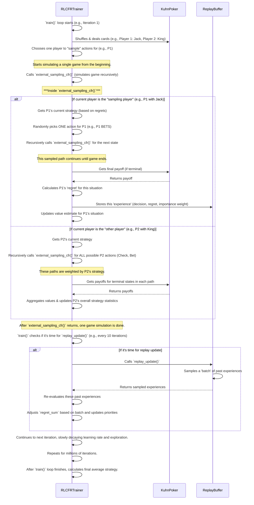

# Chapter 3: RL-CFR Training Algorithm (RLCFRTrainer)

Welcome back to our `poker-bot` journey! In [Chapter 1: KuhnPoker Game Rules](01_kuhnPoker_game_rules_.md), we learned the foundational rules of Kuhn Poker. Then, in [Chapter 2: Kuhn Poker Graphical User Interface (GUI)](02_kuhn_poker_graphical_user_interface__gui__.md), we explored how to interact with the game visually and even peeked into the bot's "thought process."

But how does the bot become so smart? How does it *learn* to play poker optimally? That's what this chapter is all about! We'll introduce the **RL-CFR Training Algorithm**, encapsulated in the `RLCFRTrainer` class. This is the true "brain" of our poker bot, the sophisticated engine that drives its learning.

### Why Do We Need the "RL-CFR Training Algorithm (RLCFRTrainer)"?

Imagine trying to teach someone to play poker perfectly. You wouldn't just tell them the rules; you'd have them practice, analyze their mistakes, and adjust their strategy over thousands of games.

The `RLCFRTrainer` does exactly this for our bot. Its central use case is: **To teach our bot to play Kuhn Poker optimally by simulating millions of games, tracking its hypothetical outcomes (regrets), and continuously refining its strategy until it becomes an expert.**

This algorithm is essential because:
1.  **Optimal Play:** It enables the bot to learn strategies that are theoretically "unbeatable" in the long run against any opponent, known as a Nash Equilibrium.
2.  **Self-Improvement:** It allows the bot to learn purely through self-play, without needing human examples or specific poker knowledge hard-coded into it.
3.  **Complex Decision Making:** Even in a simple game like Kuhn Poker, optimal play requires complex probabilistic decisions, which this algorithm figures out.

---

### What is RL-CFR? The Bot's Learning Approach

RL-CFR stands for **Reinforcement Learning - Counterfactual Regret Minimization**. It's a powerful combination of two fields:

*   **Counterfactual Regret Minimization (CFR):** This is the core algorithm used to find optimal strategies in games. It focuses on minimizing "regret" – essentially, how much a player wishes they had done something *differently* in a past situation. By minimizing regrets, the bot naturally converges to an optimal strategy.
*   **Reinforcement Learning (RL) concepts:** We boost CFR's efficiency and capabilities by adding ideas from Reinforcement Learning, such as:
    *   **Monte Carlo Sampling:** Instead of analyzing every single possible game path, we randomly sample a few paths to make calculations faster.
    *   **Experience Replay:** The bot "remembers" past game situations and its decisions, storing them in a buffer. It then periodically re-learns from these stored "experiences."
    *   **Importance Sampling:** When we use sampling, we need to mathematically adjust the "weight" of the sampled outcomes to ensure our regret calculations are still accurate.

Think of it this way: the `RLCFRTrainer` is a dedicated poker student. It plays thousands (or millions!) of hypothetical games (`CFR`), remembering what it could have done better (`regret`), and periodically reviewing its practice sessions (`experience replay`) to reinforce its learning. It doesn't play *every* possible hand in practice (`Monte Carlo sampling`), but it smartly prioritizes its learning (`importance sampling`).

---

### How to Use the `RLCFRTrainer`

The `RLCFRTrainer` class handles the entire learning process. You primarily interact with it through two main methods:

1.  `train()`: This method starts the intensive self-play and learning process.
2.  `get_action()`: Once trained, this method allows the bot to actually *play* by recommending an action based on its learned optimal strategy.

Let's see them in action!

#### 1. Training the Bot

To make our bot intelligent, we call its `train()` method, telling it how many game iterations to simulate.

```python
# Simplified from kuhn_poker_rl/codes/kuhn_poker_rl_cfr.py

from kuhn_poker_rl_cfr import RLCFRTrainer

print("Starting bot training...")

# Create an RLCFRTrainer instance
trainer = RLCFRTrainer(
    learning_rate=0.1,    # How quickly the bot adjusts its strategy
    epsilon=0.2,          # Initial exploration rate (how often it tries new things)
    buffer_capacity=50000 # How many past experiences it can remember
)

# Train the bot for 100,000 iterations (game simulations)
trainer.train(iterations=100000)

print("Bot training complete! Strategy learned.")
```
**Explanation:** This code snippet first imports `RLCFRTrainer`. It then creates an instance of the trainer, configuring some of its learning parameters (like `learning_rate` and `epsilon`). Finally, it calls the `train()` method with `100000` iterations. Behind the scenes, the bot will simulate 100,000 games, learn from each one, and update its internal strategy. The output will show progress updates during this process.

#### 2. Getting an Action from the Trained Bot

Once the bot is trained (or has loaded a pre-trained strategy), you can ask it for an action given a specific game situation. This is what the [Kuhn Poker Graphical User Interface (GUI)](02_kuhn_poker_graphical_user_interface__gui__.md) does when it's the bot's turn.

```python
# Simplified from kuhn_poker_rl/codes/kuhn_poker_rl_gui_enhanced.py

from kuhn_poker_rl_cfr import RLCFRTrainer

# Assume 'my_trainer' is an RLCFRTrainer instance that has been trained
# or loaded from a saved file (e.g., "kuhn_poker_rl_strategy.pkl").
my_trainer = RLCFRTrainer()
my_trainer.load_strategy() # Load a strategy from file if available

# Imagine this is the bot's turn.
# Bot's private card: Queen (represented as 1)
bot_card = 1 # Q
# Current game history: Player 1 checked, then bot bet. Now P1 is facing a bet.
# No, actually the history is for current situation.
# Let's say: Player 1 CHECKED (history "p"). Now it's the bot's turn.
game_history = "p" 

# The bot decides its action
action_index = my_trainer.get_action(bot_card, game_history)

if action_index == 0:
    print(f"Bot (with Queen, history '{game_history}') decides to PASS (Check)!")
else:
    print(f"Bot (with Queen, history '{game_history}') decides to BET!")

# Example output might be: Bot (with Queen, history 'p') decides to BET!
```
**Explanation:** This code snippet demonstrates how the GUI (or any other part of the project) would query the trained bot. It creates a `RLCFRTrainer` and loads a saved strategy. Then, using the bot's private `bot_card` (e.g., `1` for Queen) and the current `game_history` string (e.g., `"p"` for P1 checked), it calls `get_action()`. The method returns an `action_index` (`0` for Pass/Check/Fold, `1` for Bet/Call), representing the bot's optimal move in that situation.

---

### Under the Hood: How the Training Works

The training process is complex, but let's break it down into simpler steps. The `RLCFRTrainer` simulates game after game, constantly updating its understanding of the "best" way to play.

#### 1. High-Level Training Flow

Here’s a simplified look at what happens during each `train()` iteration:



#### 2. Core Components in Code

Let's look at simplified versions of the key methods in the `RLCFRTrainer` class.

**a. `RLCFRTrainer` Initialization (`__init__`)**
This sets up the bot's "brain" and its learning tools.

```python
# From kuhn_poker_rl/codes/kuhn_poker_rl_cfr.py

class RLCFRTrainer:
    def __init__(self, 
                 learning_rate: float = 0.01,
                 epsilon: float = 0.1,
                 buffer_capacity: int = 100000):
        
        self.game = KuhnPoker() # Our game rulebook from Chapter 1
        # Stores accumulated 'regrets' for each game situation
        self.regret_sum = defaultdict(lambda: np.zeros(2))
        # Stores accumulated strategies for averaging later
        self.strategy_sum = defaultdict(lambda: np.zeros(2))
        self.n_actions = 2 # Pass/Bet
        
        # RL components for efficient learning
        self.learning_rate = learning_rate
        self.epsilon = epsilon  # For exploration (trying new things)
        self.replay_buffer = ReplayBuffer(capacity=buffer_capacity) # Our memory!
        self.value_estimates = defaultdict(float) # To predict future outcomes
        
        self.iteration_count = 0
        self.sampling_player = 0 # Alternates between P0 and P1 each round
        # ... (other internal settings for learning rate decay etc.)
```
**Explanation:** When an `RLCFRTrainer` is created, it initializes the `KuhnPoker` game rules. It sets up `regret_sum` and `strategy_sum` as dictionaries to store learning data for every unique game state. It also prepares the Reinforcement Learning elements: `learning_rate` (how much to adjust per lesson), `epsilon` (how often to try random moves), the `replay_buffer` (its memory), and `value_estimates` (its predictions about the worth of different situations).

**b. `get_strategy` - How the Bot Makes Decisions During Training**
The bot learns by updating its `regret_sum`. This function shows how `regret_sum` is converted into a probability distribution over actions (its strategy).

```python
# From kuhn_poker_rl/codes/kuhn_poker_rl_cfr.py

class RLCFRTrainer:
    # ... __init__ and other methods ...
    
    def get_strategy(self, info_set_key: str, use_epsilon_greedy: bool = False) -> np.ndarray:
        """
        Get current strategy using regret matching with optional epsilon-greedy exploration.
        """
        regrets = self.regret_sum[info_set_key] # Get past regrets for this situation
        positive_regrets = np.maximum(regrets, 0) # Only consider positive regrets

        if positive_regrets.sum() > 0:
            # Choose actions proportional to positive regrets (regret matching)
            strategy = positive_regrets / positive_regrets.sum()
        else:
            # If no positive regrets (or all are negative), choose uniformly
            strategy = np.ones(self.n_actions) / self.n_actions
        
        # During training, sometimes take a random action (exploration)
        if use_epsilon_greedy and random.random() < self.epsilon:
            strategy = np.ones(self.n_actions) / self.n_actions # Pure random action
        
        return strategy
```
**Explanation:** This method is crucial for decision-making during training. It looks at the `regret_sum` for a given `info_set_key` (which is a unique combination of a player's private card and the game `history`). If an action has a high positive regret (meaning the bot often wished it had taken that action), its probability of choosing that action increases. If there are no positive regrets, it chooses actions uniformly. The `epsilon-greedy` part ensures that occasionally, the bot takes a completely random action, which helps it discover new, potentially better strategies.

**c. `external_sampling_cfr` - The Game Simulation and Core Learning**
This is the heart of the CFR algorithm, recursively traversing the game tree.

```python
# From kuhn_poker_rl/codes/kuhn_poker_rl_cfr.py

class RLCFRTrainer:
    # ... methods ...
    
    def external_sampling_cfr(self, cards: List[int], history: str, 
                            reach_p0: float, reach_p1: float, # Probabilities to reach this state
                            sampling_player: int) -> float:
        """
        External sampling MCCFR - samples actions for one player per iteration.
        """
        # 1. Base case: If the game is over, return the payoff.
        if self.game.is_terminal(history):
            payoff = self.game.get_payoff(cards, history)
            return payoff if sampling_player == 0 else -payoff
        
        current_player = self.game.get_current_player(history)
        info_set_key = f"{cards[current_player]}:{history}" # Unique game situation ID
        strategy = self.get_strategy(info_set_key, use_epsilon_greedy=(current_player == sampling_player))
        
        if current_player == sampling_player:
            # 2. If it's the player we're focusing on for this iteration:
            #    We sample ONLY ONE action and update regrets for it.
            
            action = np.random.choice(self.n_actions, p=strategy) # Pick one action
            next_history = history + ('p' if action == 0 else 'b')
            
            # Recursive call for the chosen action
            sampled_action_value = self.external_sampling_cfr(
                cards, next_history, # ... update reach_p0/p1 ... , sampling_player
            )
            
            # Calculate how 'good' or 'bad' each action would have been (regrets)
            # This involves using 'sampled_action_value' and 'self.value_estimates'
            # ... (complex regret calculation)
            
            # Store this learning experience in our memory buffer
            experience = Experience(
                info_set_key=info_set_key, action=action, regret=..., strategy=strategy.copy(),
                importance_weight=..., timestamp=self.iteration_count
            )
            self.replay_buffer.add(experience)
            
            # Update our total regrets for this situation
            # self.regret_sum[info_set_key][action] += (self.learning_rate * importance_weight * regret)
            
            # Update our estimate of this situation's value (bootstrapping)
            # self.value_estimates[info_set_key] = ...
            
            return sampled_action_value
            
        else:
            # 3. If it's the opponent's turn:
            #    We explore ALL actions they could take, weighted by their strategy.
            node_value = 0
            for action in range(self.n_actions):
                next_history = history + ('p' if action == 0 else 'b')
                
                # Recursive call for EACH opponent action
                action_value = self.external_sampling_cfr(
                    cards, next_history, # ... update reach_p0/p1 ... , sampling_player
                )
                node_value += strategy[action] * action_value # Weight by opponent's strategy
            
            # Accumulate opponent's strategy for calculating average strategy
            # self.strategy_sum[info_set_key] += reach_probability * strategy
            
            return node_value
```
**Explanation:** This function is the core learning loop, simulating a single game.
*   **Base Case:** If the `history` indicates the game is over (terminal state), it uses the `KuhnPoker` rules ([Chapter 1: KuhnPoker Game Rules](01_kuhnPoker_game_rules_.md)) to `get_payoff` and returns it.
*   **Sampling Player's Turn:** If it's the `sampling_player`'s turn, the bot uses `get_strategy` to pick *one* action (with a chance of exploration). It then recursively calls `external_sampling_cfr` for the outcome of that *single* chosen path. After the recursive call returns, it calculates the "regret" for all actions in that situation, stores this valuable `Experience` in the `replay_buffer` ([Experience Replay Buffer](06_experience_replay_buffer_.md)), and updates its `regret_sum` and `value_estimates` for that `info_set_key`.
*   **Opponent's Turn:** If it's the *opponent's* turn, the bot doesn't sample. Instead, it recursively explores *all* possible actions the opponent could take, weighting their outcomes by the opponent's current strategy. This ensures that the bot considers all possibilities from the opponent's perspective. It also updates the `strategy_sum` for later averaging.

**d. `replay_update` - Learning from Past Experiences**
This method leverages the [Experience Replay Buffer](06_experience_replay_buffer_.md) to stabilize and speed up learning.

```python
# From kuhn_poker_rl/codes/kuhn_poker_rl_cfr.py

class RLCFRTrainer:
    # ... methods ...
    
    def replay_update(self):
        """
        Update strategies using experience replay (RL component).
        """
        if len(self.replay_buffer.buffer) < self.batch_size:
            return # Not enough experiences in buffer yet
        
        # Sample a batch of past experiences from the replay buffer
        batch = self.replay_buffer.sample(self.batch_size)
        
        for experience in batch:
            # Retrieve the current regrets for this past situation
            current_regrets = self.regret_sum[experience.info_set_key]
            
            # Calculate a 'TD error' based on the stored regret and a decay factor
            # This simulates re-learning from this past experience
            td_error = experience.regret * (self.discount_factor ** ( (self.iteration_count - experience.timestamp) / 1000 ) )
            
            # Update the regret sum for the action taken in that experience
            # This is an RL-style update, adjusting strategy based on past outcomes
            current_regrets[experience.action] += (
                self.learning_rate * td_error * experience.importance_weight
            )
            
            # Update the 'priority' of this experience in the buffer
            # Experiences with higher 'error' (more surprising outcomes) get higher priority
            self.replay_buffer.update_priorities(experience.info_set_key, abs(td_error) + 0.01)
```
**Explanation:** This method is called periodically during training. It fetches a `batch` of previously stored `Experience`s from the `replay_buffer`. For each `experience`, it re-calculates the regret and uses it to update the `regret_sum` for that specific `info_set_key`. This is like the bot reviewing old homework problems to solidify its understanding. It also updates the `priority` of the experience in the buffer, ensuring that more "important" (e.g., higher regret) experiences are sampled more often in the future.

**e. `train` - The Master Training Loop**
This method orchestrates the entire learning process.

```python
# From kuhn_poker_rl/codes/kuhn_poker_rl_cfr.py

class RLCFRTrainer:
    # ... methods ...
    
    def train(self, iterations: int = 10000) -> None:
        """Train using RL-CFR with external sampling and experience replay"""
        cards = [0, 1, 2] # J, Q, K
        
        print(f"Starting RL-CFR training for {iterations} iterations...")
        
        for i in range(iterations):
            self.iteration_count = i # Keep track of current iteration
            
            # Gradually reduce learning rate and exploration over time
            self.learning_rate = self.initial_lr * (self.lr_decay ** i)
            self.epsilon = max(0.01, self.epsilon * 0.9999)
            
            # Shuffle cards and deal two for the round
            random.shuffle(cards)
            dealt_cards = cards[:2]
            
            # Alternate which player is the 'sampling player' for efficiency
            self.sampling_player = i % 2 
            
            # Run one game simulation and update regrets/strategies
            self.external_sampling_cfr(dealt_cards, "", 1.0, 1.0, self.sampling_player)
            
            # Periodically perform replay updates from the experience buffer
            if i % 10 == 0 and i > 0:
                self.replay_update()
            
            # Print progress every few iterations
            if (i + 1) % 1000000 == 0: # Print every million iterations
                print(f"  Iteration {i + 1}/{iterations} completed.")
        
        print("\nTraining complete! Bot has learned its optimal strategy.")
        self.print_strategy() # Show the final learned strategy
```
**Explanation:** This is the main training loop that runs for a specified number of `iterations`. In each iteration, it:
1.  **Adjusts Learning Parameters:** `learning_rate` and `epsilon` are slowly reduced over time, allowing the bot to first explore broadly and then refine its strategy more precisely.
2.  **Deals Cards:** Shuffles and deals two cards for a new game simulation.
3.  **Alternates Sampling Player:** Switches between Player 0 and Player 1 as the `sampling_player` to ensure both sides of the game are learned effectively.
4.  **Simulates Game:** Calls `external_sampling_cfr` to run one game simulation, updating regrets and strategy sums.
5.  **Experience Replay Update:** Every 10 iterations, it calls `replay_update` to process a batch of stored experiences.
This process repeats millions of times until the bot has thoroughly learned the optimal strategy.

---

### Conclusion

In this chapter, we've uncovered the "brain" behind our poker bot: the `RLCFRTrainer`. We've learned that it uses a sophisticated combination of Counterfactual Regret Minimization and Reinforcement Learning concepts like Monte Carlo sampling, experience replay, and importance sampling. This powerful algorithm allows the bot to learn an optimal, unbeatable strategy in Kuhn Poker purely through self-play. You've seen how to initiate its `train()` process and how to ask it for an `action()` once it's learned.

Now that we understand how the bot learns, a key question remains: How does the bot even *know* what situation it's in? This is where the concept of an "Information Set" comes into play.

[Next Chapter: Information Set](04_information_set_.md)
