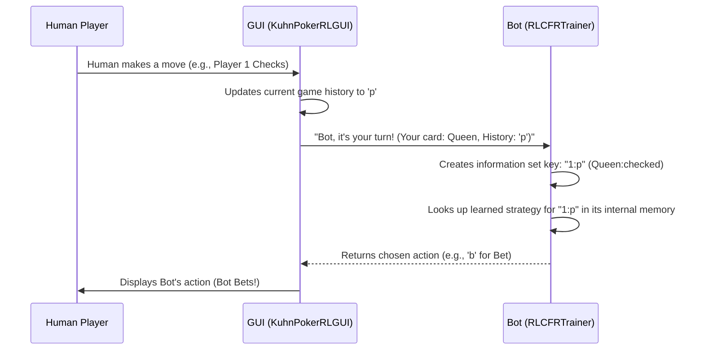

# Chapter 4: Information Set

Welcome back to our `poker-bot` tutorial! In [Chapter 3: RL-CFR Training Algorithm (RLCFRTrainer)](03_rl_cfr_training_algorithm__rlcfrtrainer__.md), we learned how our bot's "brain," the `RLCFRTrainer`, uses complex algorithms to learn an optimal strategy for Kuhn Poker. It can simulate millions of games, track its mistakes, and slowly figure out the best moves.

But here's a crucial question: How does the bot know *which* strategy to use at any given moment? How does it tell the difference between "I have a Jack and the opponent checked" versus "I have a King and the opponent bet"? It needs a way to clearly identify the unique situation it's in.

This is where the concept of an **Information Set** comes into play. It's the bot's way of understanding its current place in the game.

### Why Do We Need "Information Set"?

Imagine you're trying to follow a recipe. You need to know if you're at the "chopping vegetables" step or the "simmering the sauce" step to know what to do next.

Similarly, our poker bot needs to know the exact situation (the "step" in the game) it's facing to choose the correct action from its vast learned strategy. The central use case for information sets is: **The bot needs a clear way to identify the current game situation so it can retrieve the correct strategic action from its trained "brain."**

Without information sets, the bot would be like a chef with a great recipe book but no idea which recipe (or which step of a recipe) to use right now.

---

### What is an Information Set?

In poker, players don't know everything. You know your own cards, but not your opponent's. You know what actions have happened, but you don't know why your opponent took them (e.g., bluffing vs. strong hand). This is called "incomplete information."

An **Information Set** captures *everything a player knows* when it's their turn to act. It's the unique context that guides their decision.

For our Kuhn Poker bot, an information set is made up of two key pieces of information:

1.  **Your Private Card**: The card you were dealt (Jack, Queen, or King). This is secret from your opponent.
2.  **The Sequence of Actions**: All the moves (checks, bets, folds, calls) that have happened so far in the current round. This is public information.

It's called an "information set" because it groups together all game states that look identical to a specific player. If you have a Queen and the history is 'p' (opponent checked), it doesn't matter *what* card the opponent has, you are always in the same information set.

---

### Components of an Information Set in Kuhn Poker

Let's look at the two parts that form an information set for our bot:

#### 1. Your Private Card

In Kuhn Poker, your card can be a Jack (0), Queen (1), or King (2). This is your secret piece of information that heavily influences your decision.

*   **Example**: Holding a King usually means you want to bet. Holding a Jack might mean you want to check or bluff.

#### 2. The Action History

This is a string that records all the actions taken by players in the current round. Each 'p' means "Pass" (Check or Fold), and each 'b' means "Bet" (Bet or Call).

*   **Example Histories**:
    *   `""` (empty string): The very start of the game, no actions taken yet.
    *   `"p"`: Player 1 checked.
    *   `"b"`: Player 1 bet.
    *   `"pb"`: Player 1 checked, then Player 2 bet.

Combining your private card with the action history creates a unique snapshot of the game situation from your perspective.

---

### Representing Information Sets in Code (The `info_set_key`)

In our `poker-bot` project, the `RLCFRTrainer` uses a simple string called `info_set_key` to uniquely identify each information set. This string combines the player's private card (as a number) and the action history.

The format is typically: `"card_number:history_string"`.

Let's see how this `info_set_key` is created within the `RLCFRTrainer` class.

```python
# Simplified from kuhn_poker_rl/codes/kuhn_poker_rl_cfr.py

class RLCFRTrainer:
    # ... other methods ...

    def external_sampling_cfr(self, cards: List[int], history: str, 
                            reach_p0: float, reach_p1: float,
                            sampling_player: int) -> float:
        # ...
        current_player = self.game.get_current_player(history)
        
        # This line creates the unique identifier for the information set
        info_set_key = f"{cards[current_player]}:{history}"
        
        # This 'info_set_key' is then used to look up or store strategy
        strategy = self.get_strategy(info_set_key, use_epsilon_greedy=use_exploration)
        # ...
```
**Explanation:**
1.  `current_player`: This tells us if it's Player 0 (human) or Player 1 (bot) whose turn it is.
2.  `cards[current_player]`: This accesses the private card of the current player from the `cards` list (e.g., `cards[0]` if `current_player` is 0). If `cards[0]` is a Queen, this would be `1`.
3.  `history`: This is the string of actions that have occurred so far (e.g., `"p"`).
4.  `f"{cards[current_player]}:{history}"`: This combines them into a string like `"1:p"`.

This `info_set_key` is crucial because it acts as the "address" or "label" for a specific game situation. The bot's `regret_sum` and `strategy_sum` dictionaries (which store all its learned knowledge) use these keys to map each situation to its corresponding strategy.

---

### Solving the Use Case: Bot Deciding with Information Sets

Now let's bring it all together. Our central use case was: **The bot needs a clear way to identify the current game situation so it can retrieve the correct strategic action from its trained "brain."**

Here's how the `info_set_key` helps the bot do exactly that when it's its turn to act:



**Explanation of the Flow:**
1.  You (the Human Player) make a move, like checking.
2.  The `GUI` records this and updates the `history` string to `'p'`.
3.  The `GUI` then tells the `RLCFRTrainer` (the Bot) that it's its turn, providing the bot's private `card` (e.g., Queen, which is `1`) and the current `history` (`"p"`).
4.  The `Bot` immediately uses these two pieces of information to create its `info_set_key`: `"1:p"`.
5.  Using this unique key, the `Bot` looks up the best strategy it has learned for *that exact situation* from its internal `strategy_sum` data.
6.  Finally, the `Bot` selects an action (e.g., 'b' for Bet) based on that strategy and returns it to the `GUI`.

The `get_action` method in our `RLCFRTrainer` directly implements this lookup process.

```python
# From kuhn_poker_rl/codes/kuhn_poker_rl_cfr.py

class RLCFRTrainer:
    # ... other methods ...
    
    def get_action(self, card: int, history: str) -> int:
        """Get action from trained strategy (for playing)"""
        # 1. Create the unique information set key for the current situation
        info_set_key = f"{card}:{history}"
        
        # 2. Retrieve the average strategy that the bot has learned 
        #    for this specific information set.
        strategy = self.get_average_strategy(info_set_key)
        
        # 3. Randomly choose an action (0 for PASS, 1 for BET) 
        #    based on the probabilities in the retrieved strategy.
        return np.random.choice(self.n_actions, p=strategy)
```
**Explanation:** This simplified `get_action` method clearly shows how the `info_set_key` is formed from the `card` and `history` inputs. Then, it uses this key to fetch the pre-computed `average_strategy` (the bot's "recipe") for that exact situation, and finally, it picks an action based on that strategy.

---

### Conclusion

In this chapter, we've unlocked the concept of the **Information Set**, which is fundamental to how our `poker-bot` understands the game. We learned that an information set combines a player's private card and the public sequence of actions to define a unique game situation. The `RLCFRTrainer` uses a simple `info_set_key` string (like `"1:p"`) to label and store the optimal strategy for each of these situations. This allows the bot to efficiently retrieve and apply the correct learned behavior for any scenario it faces.

Now that we understand how the bot identifies its current situation, the next logical step is to explore how it actually *learns* and *tracks* its strategies and what it "regrets" for each of these information sets.

[Next Chapter: Strategy and Regret Tracking](05_strategy_and_regret_tracking_.md)
