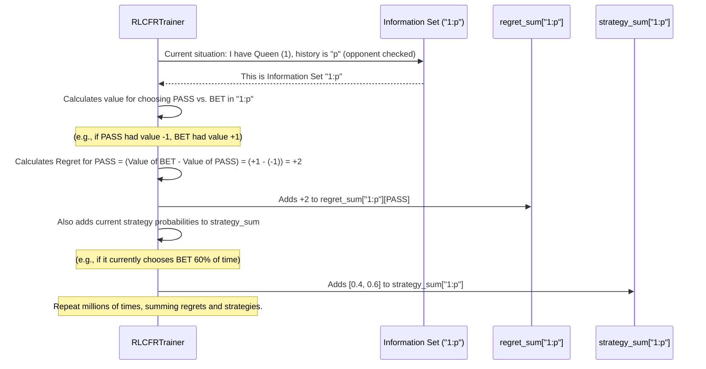

# Chapter 5: Strategy and Regret Tracking

Welcome back, aspiring poker bot trainers! In [Chapter 4: Information Set](04_information_set_.md), we learned how our bot identifies the specific game situation it's in by using an `info_set_key` (like `"1:p"` for "Queen and opponent checked"). This is like giving a unique label to every "fork in the road" the bot encounters.

But once the bot knows where it is, what does it do next? How does it decide which path to take? And how does it get better over time? This chapter introduces **Strategy and Regret Tracking**, which are the bot's internal "scorecard" and "playbook" that help it learn and make decisions.

### Why Do We Need "Strategy and Regret Tracking"?

Imagine you're trying to learn a new game, say, chess. You play a game, and afterward, you think: "Ah, if only I had moved my knight *here* instead of *there*, I would have won!" You then make a mental note to try that knight move next time. Over many games, these mental notes help you build a better "playbook" of moves.

Our `poker-bot` needs a similar internal system. Its central use case is: **To continuously learn and improve its decision-making by tracking how much it "regrets" not taking a different action in past situations, and then using these regrets to update its "strategy" (its probabilities for choosing each action).**

These concepts are essential because:
1.  **Learning from Mistakes:** "Regret" is the bot's way of quantifying how much better an alternative action *could* have been. It's the core feedback mechanism for learning.
2.  **Developing a Playbook:** "Strategy" is the direct outcome of this learning. It's the bot's refined plan of action, telling it (probabilistically) what to do in every situation.
3.  **Achieving Optimal Play:** By constantly minimizing its regrets across millions of simulated games, the bot eventually converges to an "unbeatable" (Nash Equilibrium) strategy for Kuhn Poker.

---

### What is "Regret"?

In our poker bot, "regret" is a numerical value that measures how much the bot wishes it had chosen a different action in a specific [Information Set](04_information_set_.md).

Think of it like this:

*   **You're Player 1, you have a Jack (0), and the history is "" (start of game).**
*   **You choose to PASS (`p`).**
*   Later, you find out that if you had chosen to BET (`b`) instead, you would have made an extra +2 chips because your opponent folded immediately.
*   **Your regret for PASSING is now +2 chips.** This tells the bot: "Next time I'm in this exact situation (Jack, empty history), betting might be a better idea!"

The bot doesn't just track one regret. For every possible action in an information set, it calculates a regret:
*   Regret for choosing PASS
*   Regret for choosing BET

Over many iterations of playing, these regrets accumulate. If the regret for an action is positive, it means that action has performed worse than another option and should be chosen less often in the future. If it's negative, it means that action was good. The bot wants to reduce positive regrets as much as possible.

---

### What is "Strategy"?

The "strategy" is the bot's actual "playbook" – it defines the probabilities with which the bot will choose each available action in a given [Information Set](04_information_set_.md).

It's directly derived from the accumulated regrets. Here’s the simple idea:

*   If the bot has a high **positive regret** for choosing `PASS` in a certain situation, it will **decrease** the probability of choosing `PASS` in the future.
*   If the bot has a high **negative regret** (meaning it did well by choosing that action, or it was the "best" action compared to others) for choosing `BET`, it will **increase** the probability of choosing `BET`.

This process is called **Regret Matching**. Actions that lead to less accumulated positive regret are chosen more often.

So, for an [Information Set](04_information_set_.md) like `"1:p"` (Queen, opponent checked), the strategy might look like:
*   **PASS (Check):** 0.20 (20% chance)
*   **BET:** 0.80 (80% chance)

This means, if the bot is in this situation, it will choose to BET 80% of the time, and CHECK 20% of the time, based on its accumulated learning.

---

### How Our Project Uses Strategy and Regret (Conceptually)

You won't directly "call" a method to calculate regret or set a strategy. Instead, the `RLCFRTrainer` (our bot's brain from [Chapter 3: RL-CFR Training Algorithm (RLCFRTrainer)](03_rl_cfr_training_algorithm__rlcfrtrainer__.md)) manages these internally.

Here's the conceptual flow for how the bot uses these concepts during training and actual play:

1.  **During Training:**
    *   The `RLCFRTrainer` simulates a game.
    *   When it's a player's turn in a specific [Information Set](04_information_set_.md), the bot evaluates hypothetical outcomes for each possible action.
    *   It calculates the "regret" for each action (how much better it *could* have done).
    *   These regrets are then added to an internal `regret_sum` for that information set.
    *   Simultaneously, the chosen action's probability is added to an internal `strategy_sum`.
    *   This happens millions of times over many games.

2.  **During Play (or for final strategy):**
    *   When the bot needs to make a move (e.g., in the [Kuhn Poker Graphical User Interface (GUI)](02_kuhn_poker_graphical_user_interface__gui__.md)), it identifies the current [Information Set](04_information_set_.md).
    *   It then consults its `strategy_sum` (derived from regrets) to find the probabilities for each action.
    *   Finally, it randomly picks an action based on these probabilities (e.g., 80% chance to BET, 20% chance to PASS).

---

### Under the Hood: Tracking in the `RLCFRTrainer`

Let's look at how the `RLCFRTrainer` class manages `regret_sum` and `strategy_sum` as its core data structures for learning.

#### 1. Initializing Regret and Strategy Tracking

When the `RLCFRTrainer` is created, it sets up dictionaries to store these values for every unique [Information Set](04_information_set_.md).

```python
# From kuhn_poker_rl/codes/kuhn_poker_rl_cfr.py

from collections import defaultdict
import numpy as np

class RLCFRTrainer:
    def __init__(self, # ... other parameters ...):
        # ...
        # Stores accumulated 'regrets' for each game situation
        self.regret_sum = defaultdict(lambda: np.zeros(2))
        # Stores accumulated strategies for averaging later
        self.strategy_sum = defaultdict(lambda: np.zeros(2))
        self.n_actions = 2 # PASS (0) and BET (1)
        # ...
```
**Explanation:**
*   `self.regret_sum`: This is a dictionary where each key is an `info_set_key` (e.g., `"1:p"`). The value associated with it is a NumPy array `[regret_for_PASS, regret_for_BET]`. It starts with `[0, 0]` for any new information set.
*   `self.strategy_sum`: Similarly, this dictionary stores the accumulated probabilities (or weights) for each action in an `info_set_key`. This is used to calculate the *average* strategy over many iterations, which is the final "playbook" for the bot.

#### 2. How Regrets Drive Strategy Updates During Training

The core learning happens within the `external_sampling_cfr` method during training. This is where regrets are calculated and accumulated.

Let's trace a simplified interaction:



Now, let's look at the simplified code that updates these sums inside `external_sampling_cfr`:

```python
# From kuhn_poker_rl/codes/kuhn_poker_rl_cfr.py (simplified snippet within external_sampling_cfr)

class RLCFRTrainer:
    # ...
    def external_sampling_cfr(self, cards: List[int], history: str, # ... ):
        # ...
        current_player = self.game.get_current_player(history)
        info_set_key = f"{cards[current_player]}:{history}" # The unique label!
        
        # ... (logic for sampling an action and getting action_values for each action) ...
        
        # This part happens when 'current_player' is the 'sampling_player'
        # node_value represents the expected value of the current information set
        node_value = np.dot(strategy, action_values) # e.g., if strategy is [0.4, 0.6] and values are [-1, +1]
                                                     # node_value = 0.4*(-1) + 0.6*(+1) = 0.2
        
        # Calculate regrets for all actions and update regret_sum
        for a in range(self.n_actions):
            regret = action_values[a] - node_value # How much better 'a' could have been
            
            # Add to the accumulated regret sum for this information set and action
            # (weighted by learning rate and importance sampling)
            self.regret_sum[info_set_key][a] += (
                self.learning_rate * importance_weight * regret
            )
        
        # This part happens when 'current_player' is the 'opponent'
        # (It accumulates the opponent's strategy for averaging)
        # reach_probability is how likely it is to reach this information set
        self.strategy_sum[info_set_key] += reach_probability * strategy
        
        # ... (rest of the method) ...
```
**Explanation:**
*   The `info_set_key` is used to access the correct entry in `regret_sum` and `strategy_sum`.
*   `regret = action_values[a] - node_value`: This is the core regret calculation. It compares the actual value of taking action `a` with the expected value of the information set (`node_value`). A positive regret means action `a` performed worse than average.
*   `self.regret_sum[info_set_key][a] += ...`: The calculated regret is accumulated over time in `regret_sum`. This sum acts as the raw input for the strategy.
*   `self.strategy_sum[info_set_key] += ...`: For opponent nodes (where we observe the opponent's strategy), we accumulate their strategy. This is then used to compute the *average strategy* for both players, which is the final output of the learning algorithm.

#### 3. Converting Regrets to Strategy During Training (`get_strategy`)

During training, the bot needs to decide its next move based on its *current* understanding (its regrets). The `get_strategy` method converts the `regret_sum` into probabilities.

```python
# From kuhn_poker_rl/codes/kuhn_poker_rl_cfr.py

class RLCFRTrainer:
    # ...
    def get_strategy(self, info_set_key: str, use_epsilon_greedy: bool = False) -> np.ndarray:
        """
        Get current strategy using regret matching.
        """
        regrets = self.regret_sum[info_set_key] # Get accumulated regrets
        positive_regrets = np.maximum(regrets, 0) # Only consider positive regrets

        if positive_regrets.sum() > 0:
            # Actions with higher positive regret get higher probability
            strategy = positive_regrets / positive_regrets.sum()
        else:
            # If no positive regrets (or all are negative), choose uniformly
            strategy = np.ones(self.n_actions) / self.n_actions
        
        # (Optional) During training, sometimes take a random action for exploration
        if use_epsilon_greedy and random.random() < self.epsilon:
            strategy = np.ones(self.n_actions) / self.n_actions
        
        return strategy
```
**Explanation:**
*   It retrieves the `regrets` for the given `info_set_key`.
*   `np.maximum(regrets, 0)`: Only positive regrets are considered. If an action has a negative regret, it means it was a good choice, so it's treated as having zero "missed opportunity" and doesn't get additional probability from this specific step.
*   `positive_regrets / positive_regrets.sum()`: This is the **regret matching** formula. It turns the positive regrets into a probability distribution. An action with a higher positive regret (meaning it was "missed" more often) will be chosen more frequently in the future, thus reducing that regret.

#### 4. Getting the Final "Playbook" Strategy (`get_average_strategy`)

After millions of training iterations, the bot's true learned "playbook" is the *average* of all the strategies it explored. This is retrieved using `get_average_strategy`.

```python
# From kuhn_poker_rl/codes/kuhn_poker_rl_cfr.py

class RLCFRTrainer:
    # ...
    def get_average_strategy(self, info_set_key: str) -> np.ndarray:
        """
        Get the average strategy (used for the final strategy).
        """
        avg_strategy = self.strategy_sum[info_set_key] # Get total accumulated strategies
        if avg_strategy.sum() > 0:
            # Normalize to get probabilities
            return avg_strategy / avg_strategy.sum()
        else:
            # If no strategy accumulated yet, choose uniformly
            return np.ones(self.n_actions) / self.n_actions
```
**Explanation:**
*   This method directly uses `self.strategy_sum` to compute the average strategy.
*   By summing up strategies over all iterations and then normalizing, we get a stable, optimal strategy that smoothens out the temporary fluctuations of `get_strategy` during learning. This is what the GUI uses to play against you!

---

### Conclusion

In this chapter, we've explored the crucial concepts of **Strategy and Regret Tracking**. We learned that "regret" is how the bot identifies missed opportunities, measuring how much better an alternative action could have been. By tracking and accumulating these regrets across millions of games, the bot derives its "strategy" – a probabilistic playbook that dictates its actions in every unique [Information Set](04_information_set_.md). These internal scorecards (`regret_sum`) and playbooks (`strategy_sum`) are continuously updated by the `RLCFRTrainer`, allowing our poker bot to learn and master Kuhn Poker.

Now that we understand how the bot tracks its learning and forms its strategy, let's look at another important component that helps accelerate and stabilize this learning process: the "Experience Replay Buffer."

[Next Chapter: Experience Replay Buffer](06_experience_replay_buffer_.md)
