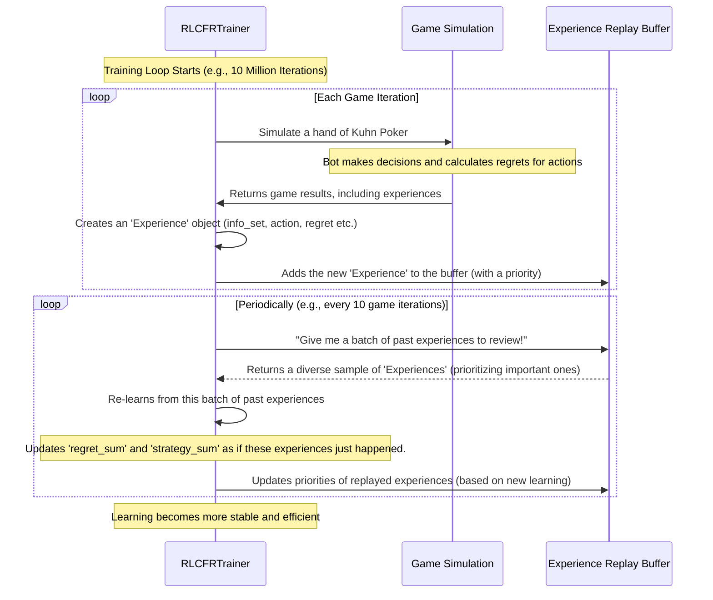

# Chapter 6: Experience Replay Buffer

Welcome back! In [Chapter 5: Strategy and Regret Tracking](05_strategy_and_regret_tracking_.md), we learned how our bot tracks its 'regrets' and builds its 'strategy' over millions of simulated games. Imagine a student diligently practicing and noting down every mistake. But what if this student quickly forgets old lessons as they learn new ones? Or what if new lessons contradict old ones, causing confusion? This is a common problem in learning systems.

This chapter introduces the **Experience Replay Buffer**, which acts like the bot's comprehensive study notebook or long-term memory. Instead of learning *only* from the very latest game, it stores past "experiences" and revisits them later, ensuring older lessons aren't forgotten and learning remains stable.

### Why Do We Need an "Experience Replay Buffer"?

Imagine you're trying to learn to play a new card game. You play a few hands, learn some tricks, then play a few more. If you only focus on the *very last* hand you played, you might quickly forget the valuable lessons from earlier hands. This can make your learning unstable and inefficient.

Our `poker-bot` faces a similar challenge. As it plays millions of simulated games, new information comes in rapidly. If it only updates its strategy based on the immediate past, it might:
*   **Forget old lessons:** Valuable strategies for specific situations might be overwritten by newer (and possibly less general) insights.
*   **Suffer from correlated experiences:** Game situations in a single game are often related. If the bot only learns from these highly correlated events, its learning might become biased or unstable.

The central use case for the Experience Replay Buffer is: **To stabilize and accelerate the bot's learning by storing past game 'experiences' and repeatedly learning from a diverse, random sample of them, preventing the bot from forgetting critical lessons and making its learning more efficient.**

Think of it like a student who regularly reviews a shuffled set of old test questions from various topics, rather than just doing the newest assignment. This makes their understanding more robust.

---

### What is an "Experience Replay Buffer"?

Let's break down the name:

1.  **Experience:** This is a snapshot of a particular moment in the game where the bot had to make a decision. It includes:
    *   The specific [Information Set](04_information_set_.md) the bot was in (e.g., "I have a Queen, and the opponent just checked").
    *   The action the bot took.
    *   The "regret" the bot felt after evaluating that action (how much better another action *could* have been).
    *   The bot's strategy (probabilities of actions) at that moment.
    *   A timestamp (when this experience happened).
    *   An "importance weight" (how important this specific experience is).

2.  **Replay:** Instead of just learning once from an experience and discarding it, the bot "replays" these stored experiences. It's like re-studying old notes. By going over past situations multiple times, the bot reinforces its learning, making its strategy more robust and less prone to forgetting.

3.  **Buffer:** This is simply a storage area, like a list or queue, that holds these "experiences." It has a limited `capacity`, meaning it can only hold a certain number of experiences at any given time. When it's full, the oldest experiences are removed to make space for new ones.

Together, the **Experience Replay Buffer** is a memory bank for the bot's past lessons.

#### A Smarter Way to Replay: Prioritized Replay

Our `poker-bot` uses an advanced version called **Prioritized Replay**. Instead of just picking experiences randomly, it prioritizes which experiences to "replay" more often.

*   **How it works:** Experiences that yielded a higher "regret" (meaning the bot made a bigger mistake or there was more to learn from that situation) are given a higher "priority." When the bot samples from the buffer, it's more likely to pick these high-priority experiences.
*   **Analogy:** Imagine your study notebook has some questions you struggled with (high regret) and some you easily solved (low regret). For effective review, you'd spend more time on the questions you struggled with. Prioritized replay does exactly that for the bot!

---

### How Our Project Uses the Experience Replay Buffer

The `Experience Replay Buffer` is an internal component managed by the `RLCFRTrainer` (our bot's brain from [Chapter 3: RL-CFR Training Algorithm (RLCFRTrainer)](03_rl_cfr_training_algorithm__rlcfrtrainer__.md)). You don't directly interact with the buffer, but the `RLCFRTrainer` uses it behind the scenes to make the learning process more efficient and stable.

Here's the conceptual flow of how the `RLCFRTrainer` uses the buffer:



**Explanation:**
1.  **Adding Experiences:** As the `RLCFRTrainer` simulates game after game using its `external_sampling_cfr` method, every time it makes a decision and calculates a `regret`, it packages this information into an `Experience` object. This `Experience` is then `add`ed to the `ReplayBuffer`.
2.  **Replaying Experiences:** Every few iterations of game simulation (e.g., every 10 games), the `RLCFRTrainer` takes a break from playing *new* games. Instead, it asks the `ReplayBuffer` to `sample` a small `batch` of past experiences. It then uses these sampled experiences to re-update its `regret_sum` and `strategy_sum`, effectively reviewing old lessons.
3.  **Prioritized Update:** After re-learning from an experience, the `RLCFRTrainer` also `update_priorities` for that experience in the buffer. This ensures that experiences that are still "puzzling" or have a lot to teach are sampled more frequently.

---

### Internal Implementation: The `ReplayBuffer` Class

The `ReplayBuffer` is a dedicated class that manages this memory. Let's look at its key parts.

First, the `Experience` itself is a simple data structure defined using `dataclass`:

```python
# From kuhn_poker_rl/codes/kuhn_poker_rl_cfr.py

from dataclasses import dataclass
import numpy as np # For strategy array

@dataclass
class Experience:
    """Store experience for replay buffer"""
    info_set_key: str
    action: int
    regret: float
    strategy: np.ndarray # The strategy probabilities when this experience happened
    importance_weight: float
    timestamp: int
```
**Explanation:** This `Experience` class is like a single entry in the bot's study notebook. It stores all the relevant details about a decision point, including the `info_set_key` (what situation it was), the `action` taken, the resulting `regret`, the bot's `strategy` at that moment, an `importance_weight` for how significant this experience is, and a `timestamp` to know when it occurred.

Now, let's look at the `ReplayBuffer` class itself.

#### 1. Initializing the Buffer (`__init__`)

```python
# From kuhn_poker_rl/codes/kuhn_poker_rl_cfr.py

from collections import deque, defaultdict
from typing import Deque # Deque is a double-ended queue

class ReplayBuffer:
    """Experience replay buffer for RL-CFR"""
    
    def __init__(self, capacity: int = 100000):
        self.buffer: Deque[Experience] = deque(maxlen=capacity)
        self.priorities = defaultdict(float) # To store priorities for each info_set
```
**Explanation:**
*   `self.buffer`: This uses a `deque` (pronounced "deck"), which is an efficient list-like structure, especially for adding and removing elements from both ends. `maxlen=capacity` ensures that if the buffer gets full, the oldest `Experience` is automatically removed when a new one is added.
*   `self.priorities`: This is a dictionary (`defaultdict`) that keeps track of the "priority" for each `info_set_key`. This is used for the **prioritized replay** feature. The higher the priority, the more likely that experience will be sampled.

#### 2. Adding an Experience (`add`)

```python
# From kuhn_poker_rl/codes/kuhn_poker_rl_cfr.py

class ReplayBuffer:
    # ... __init__ method ...
    
    def add(self, experience: Experience):
        """Add experience to buffer with priority"""
        self.buffer.append(experience)
        # Priority based on regret magnitude - new experiences with high regret are important
        priority = abs(experience.regret) + 0.01 # Small epsilon to ensure non-zero priority
        self.priorities[experience.info_set_key] = max(
            self.priorities[experience.info_set_key], 
            priority # Take the maximum priority for this info_set_key so far
        )
```
**Explanation:**
*   `self.buffer.append(experience)`: The new `experience` is simply added to the end of the `deque`. If the buffer is full, the oldest `experience` at the other end is automatically removed.
*   `priority = abs(experience.regret) + 0.01`: A priority is calculated for this `experience`. We use the absolute value of its `regret` (how much it "missed out" or "wished it did differently"). A small `0.01` is added to ensure even experiences with zero regret still have a chance of being sampled.
*   `self.priorities[experience.info_set_key] = max(...)`: We store the priority associated with the `info_set_key` of this experience. This means if we see the same `info_set_key` multiple times, we'll keep the highest priority encountered.

#### 3. Sampling Experiences (`sample`)

```python
# From kuhn_poker_rl/codes/kuhn_poker_rl_cfr.py

class ReplayBuffer:
    # ... __init__ and add methods ...
    
    def sample(self, batch_size: int) -> List[Experience]:
        """Sample batch with prioritized replay"""
        if len(self.buffer) < batch_size:
            return list(self.buffer) # If not enough experiences, return all
        
        weights = []
        experiences = list(self.buffer) # Convert deque to list for indexing
        
        for exp in experiences:
            weights.append(self.priorities.get(exp.info_set_key, 0.01))
        
        # Normalize weights to get probabilities
        total_weight = sum(weights)
        if total_weight > 0:
            probs = [w / total_weight for w in weights]
        else:
            probs = [1.0 / len(experiences)] * len(experiences) # Uniform if no priorities
        
        # Sample 'batch_size' experiences based on these probabilities
        indices = np.random.choice(
            len(experiences), 
            size=batch_size, 
            p=probs, # Use the calculated probabilities
            replace=True # Can pick the same experience multiple times
        )
        
        return [experiences[i] for i in indices]
```
**Explanation:**
*   This method is called by the `RLCFRTrainer` to get a `batch_size` number of experiences for review.
*   `weights.append(self.priorities.get(exp.info_set_key, 0.01))`: For each experience currently in the buffer, it retrieves its priority.
*   `probs = [w / total_weight for w in weights]`: These weights are then normalized to become probabilities. Experiences with higher priority get a larger slice of the `probs` pie.
*   `np.random.choice(...)`: This NumPy function then randomly selects `batch_size` indices from the `experiences` list, but it does so according to the `probs`. This means experiences with higher probabilities (higher priorities) are much more likely to be picked. `replace=True` means an experience can be picked multiple times in a single batch, which is common in deep reinforcement learning.

#### 4. Updating Priorities (`update_priorities`)

```python
# From kuhn_poker_rl/codes/kuhn_poker_rl_cfr.py

class ReplayBuffer:
    # ... methods ...
    
    def update_priorities(self, info_set_key: str, new_priority: float):
        """Update priority for an information set"""
        self.priorities[info_set_key] = new_priority
```
**Explanation:** This simple method allows the `RLCFRTrainer` to adjust the priority of an `info_set_key` after an experience involving that `info_set_key` has been replayed. If, after reviewing an experience, the bot realizes it still has a lot to learn from it (e.g., a high "TD error" in the regret calculation, which we'll see in the trainer), it can increase its priority, ensuring it gets sampled again soon.

### How `RLCFRTrainer` Interacts with the Buffer

Finally, let's see how our `RLCFRTrainer` uses this `ReplayBuffer`.

#### 1. Storing an Experience during Game Simulation

In the `external_sampling_cfr` method, after calculating the `regret` for an action, the trainer adds it to the buffer:

```python
# From kuhn_poker_rl/codes/kuhn_poker_rl_cfr.py (simplified snippet from external_sampling_cfr)

class RLCFRTrainer:
    # ...
    def external_sampling_cfr(self, cards: List[int], history: str, # ... ):
        # ... (after current_player == sampling_player block) ...
        # Calculate regrets and other values
        # ...
        
        # Store experience in replay buffer
        experience = Experience(
            info_set_key=info_set_key,
            action=action,
            regret=action_values[action] - node_value, # The actual regret value
            strategy=strategy.copy(),
            importance_weight=importance_weight,
            timestamp=self.iteration_count
        )
        self.replay_buffer.add(experience) # Add to the buffer!
        
        # ...
```
**Explanation:** This snippet shows the `RLCFRTrainer` creating an `Experience` object with all the details of the current decision point, including the `regret` it just calculated. It then calls `self.replay_buffer.add(experience)` to store this lesson.

#### 2. Replaying Experiences to Update Strategy

Periodically, the `train` method calls `replay_update` to process a batch of old experiences:

```python
# From kuhn_poker_rl/codes/kuhn_poker_rl_cfr.py (simplified snippet from replay_update)

class RLCFRTrainer:
    # ...
    def replay_update(self):
        """
        Update strategies using experience replay (RL component).
        """
        if len(self.replay_buffer.buffer) < self.batch_size:
            return # Not enough experiences yet
        
        # Sample batch from replay buffer
        batch = self.replay_buffer.sample(self.batch_size) # Get a batch of experiences!
        
        for experience in batch:
            # Decay old experiences (gives less weight to very old lessons)
            age = self.iteration_count - experience.timestamp
            decay_factor = self.discount_factor ** (age / 1000)
            
            # Retrieve the current regrets for this past situation
            current_regrets = self.regret_sum[experience.info_set_key]
            
            # Calculate a 'TD error' (Temporal Difference Error)
            # This is like re-evaluating the 'regret' for this old experience
            td_error = experience.regret * decay_factor
            
            # Update the regret sum based on this re-evaluated past experience
            current_regrets[experience.action] += (
                self.learning_rate * td_error * experience.importance_weight
            )
            
            # Update priorities in replay buffer - experiences with higher 'error'
            # (more to learn) get higher priority.
            new_priority = abs(td_error) + 0.01
            self.replay_buffer.update_priorities(experience.info_set_key, new_priority)
```
**Explanation:**
*   `batch = self.replay_buffer.sample(self.batch_size)`: This line retrieves a sample of past experiences, chosen based on their priorities.
*   The `for experience in batch:` loop then iterates through these past lessons.
*   `td_error = experience.regret * decay_factor`: This re-calculates the "error" (or regret) for the past experience, possibly decaying it if the experience is very old.
*   `current_regrets[experience.action] += (...)`: The `regret_sum` for that specific `info_set_key` and `action` is updated again, using this re-evaluated `td_error`. This is the "re-learning" part, where the bot reinforces old lessons.
*   `self.replay_buffer.update_priorities(...)`: The priority of this `info_set_key` is updated based on the new `td_error`. If the bot still has a lot to learn from this situation, its priority will remain high, ensuring it might be sampled again soon.

---

### Conclusion

In this chapter, we've explored the **Experience Replay Buffer**, the bot's crucial memory system. We learned that it stores "experiences" (snapshots of game situations, actions, and regrets) in a buffer. Instead of learning only from the most recent game, the bot "replays" these stored experiences, making its learning more stable, efficient, and preventing it from forgetting valuable past lessons. The addition of "prioritized replay" further enhances this by focusing on experiences that offer the most learning potential.

By combining the powerful `RLCFRTrainer` with the memory and stabilization provided by the `Experience Replay Buffer`, our `poker-bot` is well-equipped to learn and master Kuhn Poker.

Congratulations! You've completed the core concepts behind our `poker-bot`. You now understand the game rules, how to interact with the bot, its training algorithm, how it identifies game situations, tracks its strategy and regrets, and how it uses memory to learn efficiently. You're now ready to dive into the full code and experiment with the bot yourself!
