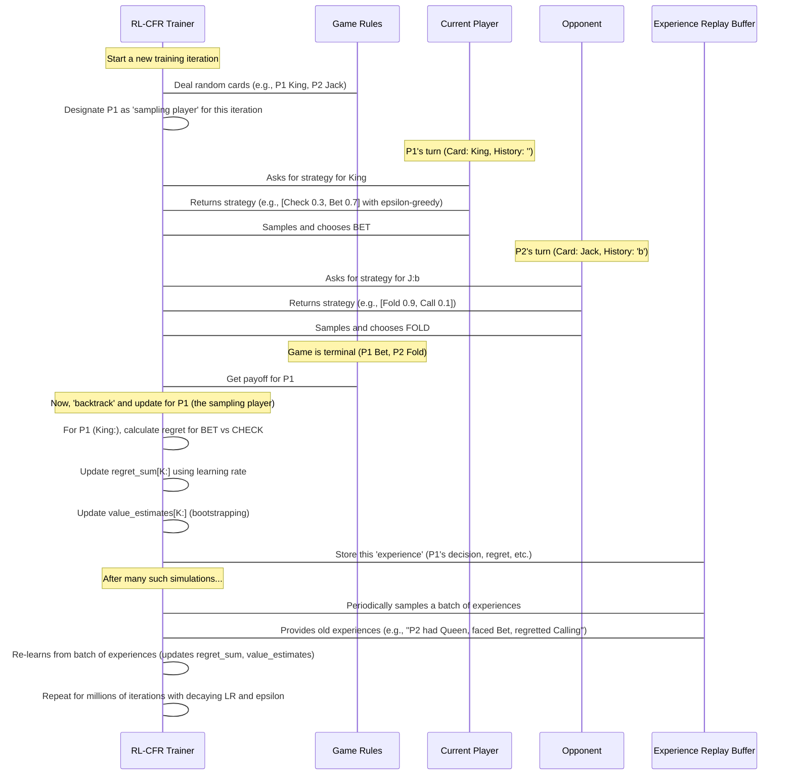

Standard CFR is incredibly powerful, but as games become larger and more complex (imagine Texas Hold'em instead of Kuhn Poker!), traversing the *entire* game tree for millions of iterations becomes computationally very expensive, sometimes even impossible.

This is where **RL-CFR (Reinforcement Learning Counterfactual Regret Minimization)** comes into play. It's like upgrading our bot's learning engine! RL-CFR combines the core ideas of CFR with smart techniques from **Reinforcement Learning (RL)** to make the learning process much more scalable and efficient. Instead of exhaustively exploring every single possible game path, RL-CFR learns from sampled experiences, making it more agile and memory-efficient.

Think of it this way: If standard CFR is like a diligent student who reads *every single page* of *every single textbook* to master a subject, RL-CFR is like a smart student who learns by attending key lectures, doing practice problems, and occasionally revisiting past mistakes. Both learn effectively, but RL-CFR is much faster and can handle much bigger "subjects" (games)!

---

### The Problem: Scaling CFR to Larger Games

The central challenge RL-CFR addresses is how to find optimal strategies for games with massive "game trees" (all possible sequences of moves). Standard CFR does this by recursively visiting *every single node* in the game tree. For Kuhn Poker, this is manageable. For games like Texas Hold'em, the number of possible game paths is astronomically large, making full tree traversal impractical.

**RL-CFR's solution:** Instead of full tree traversal, it uses **Monte Carlo sampling** to explore game paths and **experience replay** to learn more efficiently from those sampled paths.

---

### Key Concepts of RL-CFR

RL-CFR introduces several crucial concepts to enhance the traditional CFR algorithm:

#### 1. Monte Carlo Sampling (External Sampling)

*   **What it is**: Instead of exploring every possible action at every decision point, Monte Carlo sampling (specifically "External Sampling" in our case) means that for the *opponent*, we only choose *one* action to follow during a specific simulation (like rolling a dice for the opponent's move). For the player whose strategy we are currently updating, we still consider all actions.
*   **Why it's used**: It drastically reduces the number of game paths we need to explore in each iteration. Imagine a fork in the road with 10 paths. Standard CFR explores all 10. Monte Carlo sampling picks just one of those 10 paths to follow, making the simulation much quicker.
*   **Analogy**: If you're planning a trip, standard CFR maps out *every possible route* and calculates the exact time for each. Monte Carlo sampling picks a few random routes, drives them, and estimates the best based on those samples. It's less precise but much faster to get a good estimate.

#### 2. Experience Replay Buffer

*   **What it is**: A special "memory bank" where the bot stores its past game interactions, or "experiences." Each experience includes information like the situation it was in ([Information Set](02_information_set_.md)), the action it took, the regret it felt, and other details.
*   **Why it's used**: Instead of only learning from the *current* game simulation, the bot can repeatedly "re-study" old experiences from the buffer. This is vital because the sampled game paths are often noisy. Replaying past events in batches helps the bot stabilize its learning and extract more value from each experience, making it more robust and efficient.
*   **Analogy**: Like a student who revisits old notes and practice questions to reinforce learning, even after moving on to new material.

#### 3. Epsilon-Greedy Exploration

*   **What it is**: A strategy used during training to balance "trying new things" (exploration) with "doing what's known to be best" (exploitation).
    *   With a small probability (epsilon, `ε`), the bot chooses a completely random action (explore).
    *   With a high probability (1 - epsilon), the bot chooses the action that its current strategy suggests is best (exploit).
*   **Why it's used**: When using sampling, there's a risk of missing out on potentially good actions if the bot always sticks to its current "best" strategy. Epsilon-greedy exploration ensures the bot continues to experiment and discover better strategies, even if its current strategy doesn't suggest them. As training progresses, epsilon usually decreases, so the bot explores less and exploits more.
*   **Analogy**: When trying a new restaurant, you might stick to your usual order (exploitation). But occasionally, you might randomly try something new on the menu (exploration) in case it's even better!

#### 4. Learning Rate

*   **What it is**: A small number (often between 0.001 and 0.1) that determines how much the bot adjusts its strategy (or regret) based on a single new experience or regret calculation.
*   **Why it's used**: It controls the "speed" and "stability" of learning. A high learning rate makes the bot quickly change its mind, which can lead to unstable learning. A low learning rate makes changes gradual and stable. In RL-CFR, the learning rate often decays over time, meaning the bot makes larger adjustments early in training and smaller, fine-tuning adjustments later.
*   **Analogy**: How quickly you change your opinion after hearing a new piece of information. A small learning rate means you're slow to change; a large one means you're easily swayed.

#### 5. Value Estimates (Bootstrapping)

*   **What it is**: In RL-CFR, especially with Monte Carlo sampling, when the bot doesn't simulate a full path for *all* possible actions (for the sampling player), it needs a way to estimate the value of those *un-sampled* actions. It uses a learned "value estimate" for the expected outcome from a given [Information Set](02_information_set_.md).
*   **Why it's used**: This is a technique called "bootstrapping" from reinforcement learning. It allows the bot to make estimates about future outcomes without having to run a full simulation for every single alternative. It fills in the gaps created by sampling.
*   **Analogy**: If you have to quickly decide between two paths, but only have time to explore one, you might use your general "gut feeling" or past experience to guess the outcome of the un-explored path.

---

### How RL-CFR Learns the Probabilities (Central Use Case)

The goal of RL-CFR is still to learn the optimal probabilities for each action in every [Information Set](02_information_set_.md), just like standard CFR. However, it achieves this through a modified, more efficient cycle:

1.  **Start an Iteration**: Begin a new round of training.
2.  **Sample a Player**: Decide which player's strategy we will focus on updating in this iteration (e.g., Player 1). All updates to `regret_sum` will be for this `sampling_player`.
3.  **Simulate a Hand with External Sampling**:
    *   Deal random cards.
    *   Traverse the game path.
    *   When it's the `sampling_player`'s turn:
        *   Get the strategy (which might include **epsilon-greedy exploration**).
        *   Choose one action to follow based on this strategy (Monte Carlo sampling).
        *   For *other* possible actions not taken, use **value estimates** to approximate their outcome.
    *   When it's the *opponent*'s turn:
        *   Also choose one action to follow based on *their* current strategy (this is the "external sampling" part).
4.  **Compute Regrets and Update Value Estimates**: At each decision point for the `sampling_player`, calculate regrets for all actions. Update `regret_sum` and `value_estimates` using a **learning rate**.
5.  **Store Experience**: Record the `sampling_player`'s decision, regrets, and other details as an "experience" in the **experience replay buffer**.
6.  **Perform Replay Update (Periodically)**: After several game simulations (e.g., every 10 iterations), take a batch of past experiences from the **replay buffer**. Replay these experiences to update `regret_sum` again, reinforcing learning.
7.  **Repeat**: Do this millions of times, adapting the **learning rate** and **epsilon** over time.

This approach means the bot doesn't need to simulate *every single branch* of the game tree in every iteration. It learns from sampled paths and reuses past experiences, making it much faster for complex games.

Here's a simplified view of the RL-CFR process:



---

### RL-CFR in Code

Let's look at the `RLCFRTrainer` class in `kuhn_poker_rl/kuhn_poker_rl_cfr.py` to see how these concepts are implemented.

First, the `RLCFRTrainer`'s initialization includes the new RL components:

```python
# From kuhn_poker_rl/kuhn_poker_rl_cfr.py

class RLCFRTrainer:
    def __init__(self, 
                 learning_rate: float = 0.01,
                 discount_factor: float = 1.0, # Used for experience decay, not game value discount
                 epsilon: float = 0.1,         # Exploration rate
                 buffer_capacity: int = 100000,
                 batch_size: int = 32):
        
        self.game = KuhnPoker()
        self.regret_sum = defaultdict(lambda: np.zeros(2))
        self.strategy_sum = defaultdict(lambda: np.zeros(2))
        self.n_actions = 2
        
        # RL components
        self.learning_rate = learning_rate
        self.discount_factor = discount_factor # Slight discounting for older experiences
        self.epsilon = epsilon  # For epsilon-greedy exploration
        self.replay_buffer = ReplayBuffer(capacity=buffer_capacity)
        self.batch_size = batch_size
        
        # Value estimates for bootstrapping
        self.value_estimates = defaultdict(float)
        
        # ... (other tracking variables) ...
```
Here, `learning_rate`, `epsilon`, `replay_buffer`, and `value_estimates` are key additions. `defaultdict` is used for `regret_sum` and `strategy_sum` to automatically create new entries with zero arrays when an `info_set_key` is encountered for the first time.

The `get_strategy` method now incorporates **epsilon-greedy exploration**:

```python
# From kuhn_poker_rl/kuhn_poker_rl_cfr.py

    def get_strategy(self, info_set_key: str, use_epsilon_greedy: bool = False) -> np.ndarray:
        """
        Get current strategy using regret matching with optional epsilon-greedy exploration.
        """
        regrets = self.regret_sum[info_set_key]
        positive_regrets = np.maximum(regrets, 0)
        
        if positive_regrets.sum() > 0:
            strategy = positive_regrets / positive_regrets.sum()
        else:
            strategy = np.ones(self.n_actions) / self.n_actions
        
        # Epsilon-greedy exploration during training
        if use_epsilon_greedy and random.random() < self.epsilon:
            # Exploration: uniform random action
            strategy = np.ones(self.n_actions) / self.n_actions
        
        return strategy
```
If `use_epsilon_greedy` is `True` (meaning it's the `sampling_player`'s turn), there's a chance (`epsilon`) to take a random action instead of the regret-matching one.

The core `external_sampling_cfr` method is where Monte Carlo sampling and RL updates happen. Here's a simplified look at how it samples and updates for the `sampling_player`:

```python
# From kuhn_poker_rl/kuhn_poker_rl_cfr.py

    def external_sampling_cfr(self, cards: List[int], history: str, 
                            reach_p0: float, reach_p1: float,
                            sampling_player: int) -> float:
        """
        External sampling MCCFR - samples actions for one player per iteration.
        """
        if self.game.is_terminal(history):
            # Base case: if game is over, return payoff
            payoff = self.game.get_payoff(cards, history)
            return payoff if sampling_player == 0 else -payoff
        
        current_player = self.game.get_current_player(history)
        info_set_key = f"{cards[current_player]}:{history}"
        
        # Get strategy, with exploration for the sampling player
        use_exploration = (current_player == sampling_player)
        strategy = self.get_strategy(info_set_key, use_epsilon_greedy=use_exploration)
        
        # --- Only for the sampling player, we sample one action ---
        if current_player == sampling_player:
            # Sample a single action based on strategy (or randomly if exploring)
            action = np.random.choice(self.n_actions, p=strategy) # Or random.randint if exploring
            
            # Recursively call for the sampled action
            next_history = history + ('p' if action == Actions.PASS.value else 'b')
            action_value = self.external_sampling_cfr(
                cards, next_history, reach_p0 * strategy[action], reach_p1, sampling_player
            )

            # Calculate regret for all actions (counterfactual)
            action_values = np.zeros(self.n_actions)
            action_values[action] = action_value # The value from the sampled path

            # For unsampled actions, use value estimates (bootstrapping)
            for a in range(self.n_actions):
                if a != action:
                    cf_history = history + ('p' if a == Actions.PASS.value else 'b')
                    cf_info_set = f"{cards[current_player]}:{cf_history}"
                    action_values[a] = self.value_estimates.get(cf_info_set, 0)
            
            node_value = np.dot(strategy, action_values) # Expected value of this node
            
            # Calculate importance sampling weight (counterfactual reach)
            counterfactual_reach = reach_p1 if current_player == 0 else reach_p0
            
            # Update regrets with learning rate (RL-style update)
            for a in range(self.n_actions):
                regret = action_values[a] - node_value
                self.regret_sum[info_set_key][a] += (
                    self.learning_rate * counterfactual_reach * regret
                )
            
            # Store experience in replay buffer
            experience = Experience(
                info_set_key=info_set_key,
                action=action,
                regret=action_values[action] - node_value, # Regret for the sampled action
                strategy=strategy.copy(),
                importance_weight=counterfactual_reach,
                timestamp=self.iteration_count
            )
            self.replay_buffer.add(experience)
            
            # Update value estimate (bootstrapping)
            self.value_estimates[info_set_key] = (
                (1 - self.learning_rate) * self.value_estimates[info_set_key] +
                self.learning_rate * node_value
            )
            return action_value # Return value of the sampled path
        
        else: # --- For the opponent (not the sampling player), we also sample one action ---
            # ... (similar sampling logic for opponent, but no regret/value/buffer updates) ...
            # The opponent just plays, contributing to the game path for the sampling player.
            # However, its strategy_sum is still updated for final average strategy.
            reach_probability = reach_p0 if current_player == 0 else reach_p1
            self.strategy_sum[info_set_key] += reach_probability * strategy # Update for final average strategy
            return node_value # Simplified
```
This snippet shows how the `sampling_player` only explores *one* path (`action`), but calculates regrets for *all* actions, using `value_estimates` for the un-sampled ones. The `learning_rate` scales the regret updates, and the `Experience` is added to the `replay_buffer`.

The `ReplayBuffer` class handles storing and sampling experiences:

```python
# From kuhn_poker_rl/kuhn_poker_rl_cfr.py

@dataclass
class Experience:
    info_set_key: str
    action: int
    regret: float
    strategy: np.ndarray
    importance_weight: float
    timestamp: int

class ReplayBuffer:
    def __init__(self, capacity: int = 100000):
        self.buffer: Deque[Experience] = deque(maxlen=capacity)
        self.priorities = defaultdict(float) # For prioritized replay
        
    def add(self, experience: Experience):
        self.buffer.append(experience)
        # Priority can be based on regret magnitude for more efficient learning
        priority = abs(experience.regret) + 0.01 
        self.priorities[experience.info_set_key] = max(
            self.priorities[experience.info_set_key], priority
        )
    
    def sample(self, batch_size: int) -> List[Experience]:
        if len(self.buffer) < batch_size:
            return list(self.buffer)
        
        # Samples experiences, potentially with higher probability for higher-priority ones
        # ... (simplified to random sample for this tutorial) ...
        weights = []
        experiences = list(self.buffer)
        for exp in experiences:
            weights.append(self.priorities.get(exp.info_set_key, 0.01))
        
        total_weight = sum(weights)
        probs = [w / total_weight for w in weights] if total_weight > 0 else [1.0 / len(experiences)] * len(experiences)
        
        indices = np.random.choice(len(experiences), size=batch_size, p=probs, replace=True)
        return [experiences[i] for i in indices]
```
The `ReplayBuffer` stores `Experience` objects. The `add` method stores new experiences and assigns a priority (based on how "surprising" or "regretful" the experience was). The `sample` method then retrieves a `batch_size` number of experiences, potentially prioritizing those with higher importance.

Finally, the `replay_update` method processes these sampled experiences:

```python
# From kuhn_poker_rl/kuhn_poker_rl_cfr.py

    def replay_update(self):
        """
        Update strategies using experience replay (RL component).
        """
        if len(self.replay_buffer.buffer) < self.batch_size:
            return
        
        batch = self.replay_buffer.sample(self.batch_size)
        
        for experience in batch:
            # Decay old experiences (using discount_factor and timestamp)
            age = self.iteration_count - experience.timestamp
            decay_factor = self.discount_factor ** (age / 1000) # Older experiences have less weight
            
            # Update regret with decayed importance
            current_regrets = self.regret_sum[experience.info_set_key]
            
            # Apply TD-error like update
            td_error = experience.regret * decay_factor
            current_regrets[experience.action] += (
                self.learning_rate * td_error * experience.importance_weight
            )
            
            # Update priorities in replay buffer based on new regret
            new_priority = abs(td_error) + 0.01
            self.replay_buffer.update_priorities(experience.info_set_key, new_priority)
```
The `replay_update` method iterates through a batch of experiences. For each experience, it recalculates the regret update (applying a `decay_factor` for older experiences) and adds it to the `regret_sum` for that [Information Set](02_information_set_.md), scaled by the `learning_rate` and `importance_weight`. It also updates the priority of the experience.

---

### CFR vs. RL-CFR: A Quick Comparison

| Feature             | Plain CFR                                    | RL-CFR                                                    |
| :------------------ | :------------------------------------------- | :-------------------------------------------------------- |
| **Game Traversal**  | Full game tree traversal                     | Monte Carlo (External) Sampling: explores specific paths  |
| **Learning Speed**  | Slower for large games                       | Faster for large games (fewer calculations per iteration) |
| **Memory Usage**    | Explicitly stores data for every game state  | Stores sampled `Experiences` in a `ReplayBuffer`          |
| **Exploration**     | Implicit (random play if regrets are zero)   | Explicit (e.g., Epsilon-Greedy during sampling)           |
| **Updates**         | Immediate, per-node during traversal         | Primary updates are from `ReplayBuffer` in batches        |
| **Scalability**     | Limited by game tree size                    | High (scales well to larger games)                        |
| **Key Mechanism**   | Regret Minimization                          | Regret Minimization + Reinforcement Learning concepts     |

---

### Conclusion

You've now learned about **RL-CFR (Reinforcement Learning Counterfactual Regret Minimization)**, a powerful and scalable evolution of the CFR algorithm. By integrating Monte Carlo sampling, an experience replay buffer, epsilon-greedy exploration, and learning rates, RL-CFR allows our poker bot to learn effective strategies much more efficiently, especially for larger and more complex poker variants. It's a key technique for building AI that can master real-world imperfect information games.

While CFR and RL-CFR are powerful for finding optimal strategies against rational opponents, there are other ways to approach building a poker bot, especially if you want it to adapt to and exploit *sub-optimal* opponents. In the next chapter, we'll explore a different Reinforcement Learning approach: the **Q-Learning Agent (MDP-based RL)**, which frames the game as a series of decisions in a known environment.