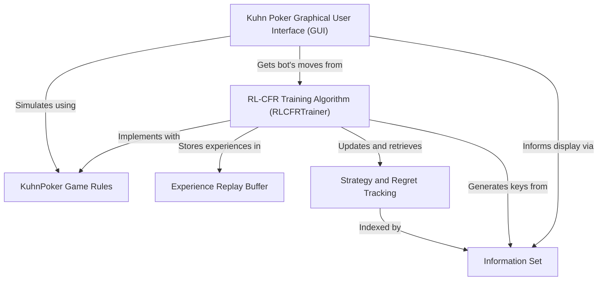

# poker-bot

This project is a **poker bot** designed to play the simplified card game *Kuhn Poker*. It leverages an advanced artificial intelligence technique called **RL-CFR** (Reinforcement Learning - Counterfactual Regret Minimization) to *learn optimal strategies* by simulating millions of games and refining its actions. The system also features a **graphical user interface** where a human player can challenge the trained AI, observing its "thought process" and strategy adherence in real-time.

## Visual Overview

## Chapters

1. [KuhnPoker Game Rules
](01_kuhnpoker_game_rules_.md)
2. [Kuhn Poker Graphical User Interface (GUI)
](02_kuhn_poker_graphical_user_interface__gui__.md)
3. [RL-CFR Training Algorithm (RLCFRTrainer)
](03_rl_cfr_training_algorithm__rlcfrtrainer__.md)
4. [Information Set
](04_information_set_.md)
5. [Strategy and Regret Tracking
](05_strategy_and_regret_tracking_.md)
6. [Experience Replay Buffer
](06_experience_replay_buffer_.md)
